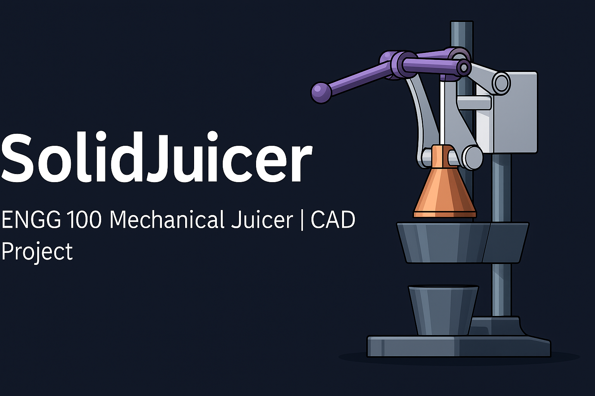

# SolidJuicer

A manually operated **Mechanical Juicer** designed using **Solid Edge** for ENGG 100 (2023 Spring), University of Regina.

## 🛠️ Tools Used
- Solid Edge (3D Modeling)
- AutoCAD (if applicable)
- Engineering design methodology
- Team collaboration and brainstorming

## 📂 Project Overview
This project involved designing a mechanical juicer to efficiently extract juice using lever-based mechanical force. The team focused on ergonomics, mechanical advantage, and usability in kitchen environments. The model was created and refined in Solid Edge.

## 🧱 Design Features
- Manual lever-based juice extraction  
- Cone press mechanism for citrus fruits  
- Stable base and ergonomic handle  
- Compact design suitable for kitchen countertops

## 📅 Timeline
- Idea Generation: Week 1–2  
- CAD Modeling: Week 3–5  
- Review & Improvements: Week 6  
- Final Submission: Week 7  

## 🔍 Learning Outcomes
- Introduction to CAD (Solid Edge)  
- Team collaboration & project planning  
- Real-world problem solving  
- Mechanical system design thinking

  

